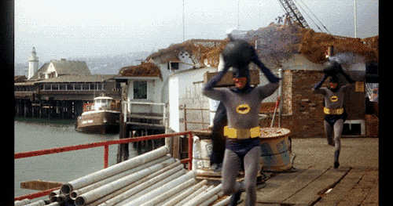

# About *interleave.gif*
*interleave.gif* takes two gifs and interleaves the frames of the gifs into a new gif. The results are usually pretty stroby but can sometimes be fun

## Selecting Gifs
Gifs come from [Giphy](https://giphy.com/). Interleaved gifs are created from a primary gif and an additional gif.

The primary gif defines the size and timing of the interleaved gif. The first frame of the primary gif is also always the first frame of the interleaved gif. 

Frames from the secondary gif are inserted between frames of the primary gif. 

## Interleave Mode
The interleave mode controls how frames of the two gifs are combined

#### Even Weave
Even weave attempts to evenly distribute the frames of the two gifs. For example, if we have a gif `A` with 6 frames and a gif `B` with 2 frames, even weave will produce the following frame sequence:

```
A0 A1 A2 B0 A3 A4 A5 B1
```

Even Weave works best if the gifs have a similar number of frames, however this is not required.


#### Even Weave Within
Similar behavior to even weave, but distributes secondary gif within the primary gif. Again using gif `A` with 6 frames and gif `B` with 2 frames, this produces:

```
A0 A1 B0 A2 A3 B1 A4 A5
```


#### Alternate
Alternate frames from the two gifs. The resulting gif always has twice the number of frames as the input gif. If the secondary gif is shorted, repeat. If it is longer, drop frames. 

Using our example gif `A` with 6 frames and gif `B` with 2 frames, this produces:

```
A0 B0 A1 A1 A2 B0 A3 B1 A4 B0 A5 B1
```


## Scaling Modes
The interleaved gif always has the same dimensions as the primary gif. The scaling mode controls how the frames of secondary gif are resized to fit within the primary gif.

#### Scale to fit
Scales the frames of the secondary gif to fit within the primary gif. Works best if the gifs have similar dimensions.



#### Scale and crop
Scales the frames of the secondary gif proportionally to fit within the primary gif. Parts of the secondary gif may be cropped.


#### Actual size
Draw the secondary gif at actual size within the primary gif.

